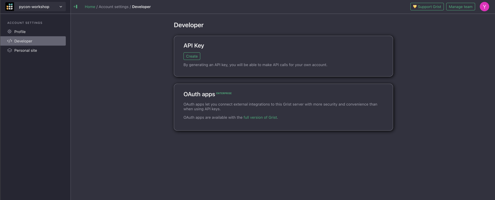

## Welcome {.center}

<!-- Add the event, date, and a one-sentence promise for the workshop. -->

---

## About me {.about-me}

::: {.columns}

::: {.column width="60%"}

::: {.incremental}
- 🐍 Pythonista with 18 years of experience 🇦🇷 🧉
  - Co-organized SciPy Latin America
  - PyCon Argentina and EuroPython speaker
- 🚜 Former CTO at [Hello Tractor](https://hellotractor.com/)
- 🧪 Software Engineer at IBM Research
- 🛰️ Worked on [foundational models for geospatial applications](https://www.earthdata.nasa.gov/news/nasa-ibm-openly-release-geospatial-ai-foundation-model-nasa-earth-observation-data)
- 💬 Worked on [Flowpilot](https://research.ibm.com/projects/flowpilot), providing core features to different products and divisions
- 💬 Currently working on [Datascape], a data harness for insight generation for enterprise data scale.
:::

:::

::: {.column width="40%"}

{fig-alt="A cartoon Python writing a spreadsheet formula with a fountain pen"}

:::

:::

---

## Follow along

<!-- Add links and QR codes for the slides, repository, and workshop materials. -->


---

# Should I attend this workshop?

---

::: {.incremental}
- If you want to have full control over your the data in your spreadsheets
- If you want have structure and tighter control over your speadsheets
- If you want to personalize how you interact with your data in a Pythonic way
- If you want to create hyper personalized applications arround spreadsheets
  with AI.
:::

---

# Grist

---

## A spreadsheet or a database

::: {.incremental}
- Grist is an Open Source (and Self Hostable) spreadsheet
  that uses Python **data types** for columns. The SaaS version of it lives in [https://getgrist.com](https://getgirst.com)
- It stores everything as a SQLite database that is easy to share.
- And when we put a `=` we can start typing python
- Row and column formatting or styling can be wirtten asso with Python
- Has some
:::

---

## Grist Architecture

```{mermaid}
%%{init: {
  "theme": "base",
  "flowchart": {"curve": "linear", "htmlLabels": true, "nodeSpacing": 40, "rankSpacing": 40, "diagramPadding": 6},
  "themeVariables": {
    "background": "#fdf6e3",
    "primaryColor": "#e4f1f8",
    "primaryTextColor": "#263238",
    "primaryBorderColor": "#24557a",
    "lineColor": "#607d8b",
    "clusterBkg": "#f8f1df",
    "clusterBorder": "#9aadaf",
    "fontFamily": "system-ui, sans-serif",
    "fontSize": "25px"
  }
}}%%
flowchart TB
    UI["Spreadsheet UI"] --> Engine["Document engine<br/>(Node.js)"]
    Engine <--> DB[("SQLite")]
    Engine --> Sandbox["Sandboxed Python"] --> Formulas["Formulas"]
    Formulas --> Engine
    Engine <--> API["Grist REST API"]

    API <--> Notebook["Python notebook"]
    API <--> Gry["gry CLI"]
    API <-.-> MCP["With MCP"]


    classDef ui fill:#e4f1f8,stroke:#24557a,color:#263238,stroke-width:2px,font-size:25px;
    classDef python fill:#fff0c9,stroke:#8b4b00,color:#263238,stroke-width:2px,font-size:25px;
    classDef data fill:#edf3df,stroke:#5f6f36,color:#263238,stroke-width:2px,font-size:25px;
    classDef client fill:#dfeecf,stroke:#5f6f36,color:#263238,stroke-width:2px,font-size:25px;
    classDef mcp fill:#fdf6e3,stroke:#5f6f36,color:#263238,stroke-width:2px,stroke-dasharray:6 4,font-size:25px;
    class UI,Engine,API ui;
    class Sandbox,Formulas python;
    class Notebook,Gry client;
    class DB data;
    class MCP mcp;
    linkStyle default stroke:#607d8b,stroke-width:2px;
```

## Workshop services

```{mermaid}
%%{init: {
  "theme": "base",
  "flowchart": {"curve": "linear", "htmlLabels": true, "nodeSpacing": 34, "rankSpacing": 42, "diagramPadding": 4},
  "themeVariables": {
    "background": "#fdf6e3",
    "primaryTextColor": "#17324d",
    "lineColor": "#6b7c83",
    "fontFamily": "system-ui, sans-serif",
    "fontSize": "21px"
  }
}}%%
flowchart TB
    Caddy["Caddy<br/><b>localhost:8000 → :80</b>"]
    Grist["Grist<br/><b>localhost:8484 → :8484</b>"]
    Marimo["Marimo<br/><b>localhost:8081 → :8080</b>"]
    WebUI["Hermes WebUI<br/><b>localhost:4096 → :8787</b>"]
    Hermes["Hermes<br/><b>:8642 internal</b>"]

    WebUI -->|"HTTP API"| Hermes

    CaddyFiles["<b>Caddy files · read-only</b><br/>./caddy → /srv<br/>Caddyfile → /etc/caddy/Caddyfile"]
    Workspace["<b>Workspace bind</b><br/>. → /workspace"]
    GristData[("<b>grist-data</b><br/>Grist: /persist")]
    HermesData[("<b>hermes-data</b><br/>Hermes: /opt/data<br/>WebUI: ~/.hermes")]
    HermesSource[("<b>hermes-agent-src</b><br/>Hermes: /opt/hermes<br/>WebUI: ~/.hermes/hermes-agent · RO")]

    Caddy --- CaddyFiles
    Grist --- GristData
    Marimo --- Workspace
    WebUI --- Workspace
    WebUI --- HermesData
    Hermes --- HermesData
    WebUI --- HermesSource
    Hermes --- HermesSource

    classDef service fill:#d9eef7,stroke:#1f5d78,color:#17324d,stroke-width:2.5px;
    classDef agent fill:#e2def5,stroke:#5b4b8a,color:#2f2850,stroke-width:2.5px;
    classDef bind fill:#ffe6ad,stroke:#a85d00,color:#4d3300,stroke-width:2.5px;
    classDef volume fill:#dcecc5,stroke:#55752b,color:#294214,stroke-width:2.5px;
    class Caddy,Grist,Marimo service;
    class Hermes,WebUI agent;
    class CaddyFiles,Workspace bind;
    class GristData,HermesData,HermesSource volume;
    linkStyle default stroke:#6b7c83,stroke-width:2.5px;
    linkStyle 0 stroke:#5b4b8a,stroke-width:3px;
```


## UI Structure

Working in Grist is organized in this way:

::: {.incremental}
-  A site (each user has his/hers)
-  A workspace, this is like folders and contain documents
-  Documents
  -  Database
  -  Pages, views and other presentation data

:::


<!-- Source: https://www.youtube.com/watch?v=X7BnmstKnAQ  -->

## A grist Spreadsheets


---

## Column types

::: {.columns}
::: {.column}

:::
::: {.column}

:::
:::

## Trying out dates

::: {.columns}
::: {.column}

:::
::: {.column}

:::
:::


<!-- TODO: Examples from https://support.getgrist.com/examples/ -->

# Accessing your data over the API

---

## Getting the account's API key

In Grist settings we can jump in directly into the API Console.



---

## The `gry` CLI

---

## What about a notebook?

---

<!-- Show `gry` -->
---

---


# Using AI

---

## Connecting through MCP

<!-- MCP server options, official, Python and JavaScript one -->

---

---

## Using Hermes

---

---

# Closing words

::: {.incremental}
- The level of control
:::
