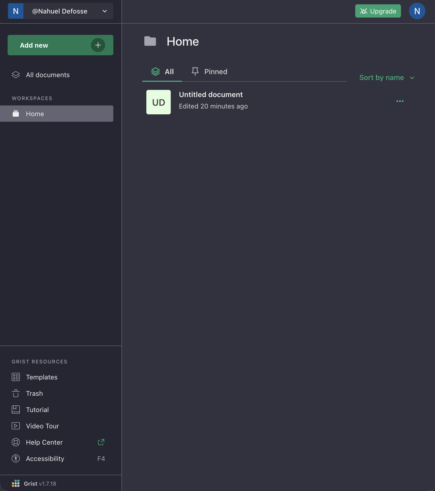
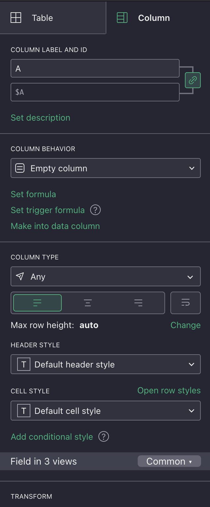
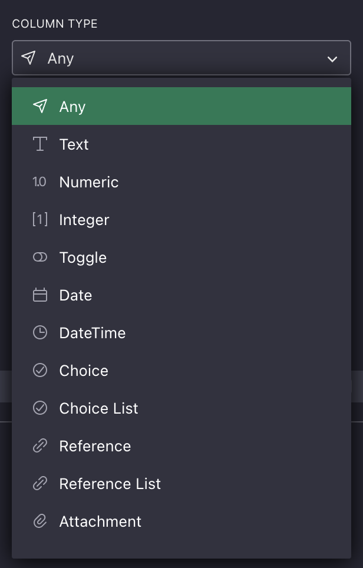
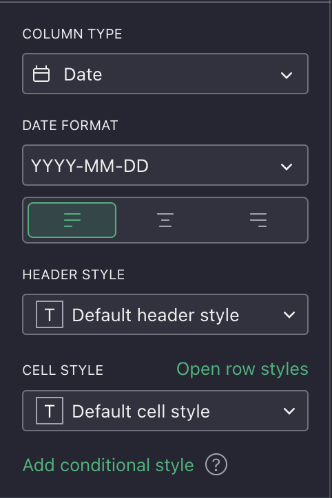
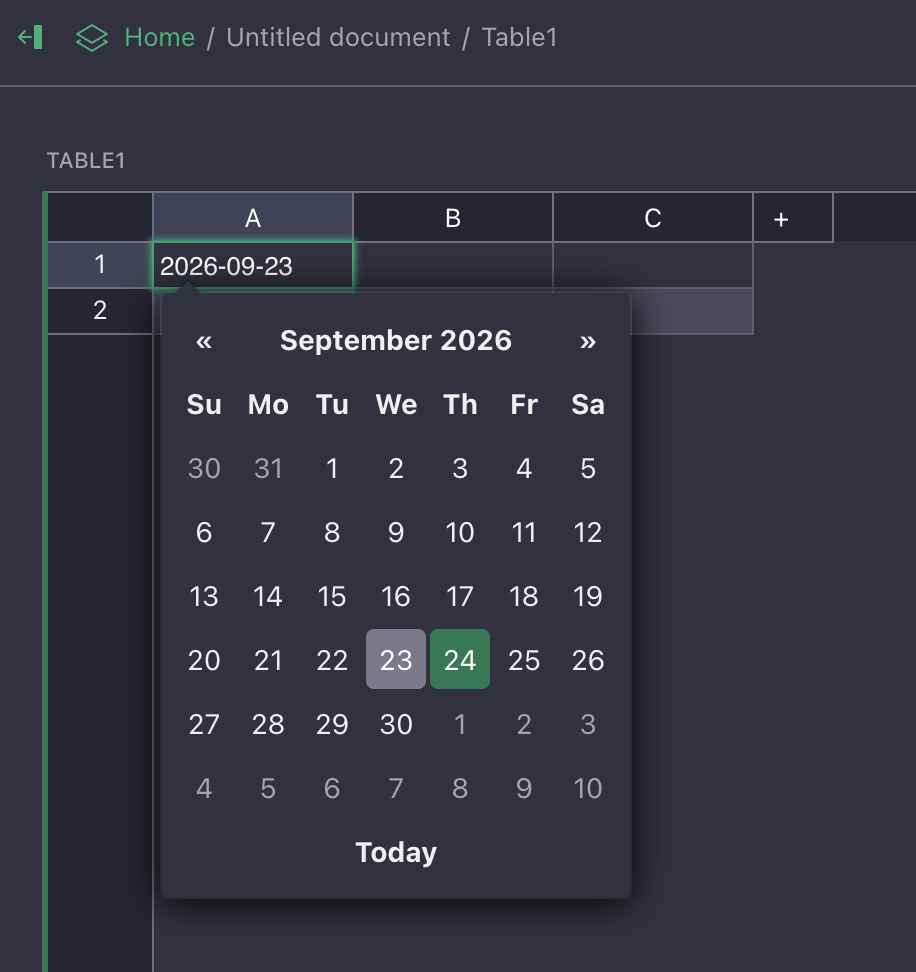

## Welcome {.center}

<!-- Add the event, date, and a one-sentence promise for the workshop. -->

---

## About me {.about-me}

::: {.columns}

::: {.column width="60%"}

::: {.incremental}
- 🐍 Pythonista with 18 years of experience 🇦🇷 🧉
  - Co-organized SciPy Latin America
  - PyCon Argentina and EuroPython speaker
- 🚜 Former CTO at [Hello Tractor](https://hellotractor.com/)
- 🧪 Software Engineer at IBM Research
- 🛰️ Worked on [foundational models for geospatial applications](https://www.earthdata.nasa.gov/news/nasa-ibm-openly-release-geospatial-ai-foundation-model-nasa-earth-observation-data)
- 💬 Worked on [Flowpilot](https://research.ibm.com/projects/flowpilot), providing core features to different products and divisions
- 💬 Currently working on [Datascape], a data harness for insight generation for enterprise data scale.
:::

:::

::: {.column width="40%"}

{fig-alt="A cartoon Python writing a spreadsheet formula with a fountain pen"}

:::

:::

---

## Follow along

<!-- Add links and QR codes for the slides, repository, and workshop materials. -->

---

# Should I attend this workshop?

---

::: {.incremental}
- If you want to have full control over your the data in your spreadsheets
- If you want have structure and tighter control over your speadsheets
- If you want to personalize how you interact with your data in a Pythonic way
- If you want to create hyper personalized applications arround spreadsheets
  with AI.
:::

---

# Grist

---

## A spreadsheet or a database

::: {.incremental}
- Grist is an Open Source (and Self Hostable) spreadsheet
  that uses Python **data types** for columns. The SaaS version of it lives in [https://getgrist.com](https://getgirst.com)
- It stores everything as a SQLite database that is easy to share.
- And when we put a `=` we can start typing python
- Row and column formatting or styling can be wirtten asso with Python
- Has some
:::

## Structure

Working in Grist is organized in this way:

::: {.incremental}
-  A site (each user has his/hers)
-  A workspace, this is like folders and contain documents
-  Documents
  -  Database
  -  Pages, views and other presentation data

:::

## A grist Spreadsheets

---
## Column types

::: {.columns}
::: {.column}

:::
::: {.column}

:::
:::

## Trying out dates

::: {.columns}
::: {.column}

:::
::: {.column}

:::
:::

# Accessing your data over the API

---

## API Console

In Grist settings we can jump in directly into the API Console.

---

## What about a notebook?

---

---

---

# Using AI

---

---

---

# Closing words

::: {.incremental}
- The level of control
:::
